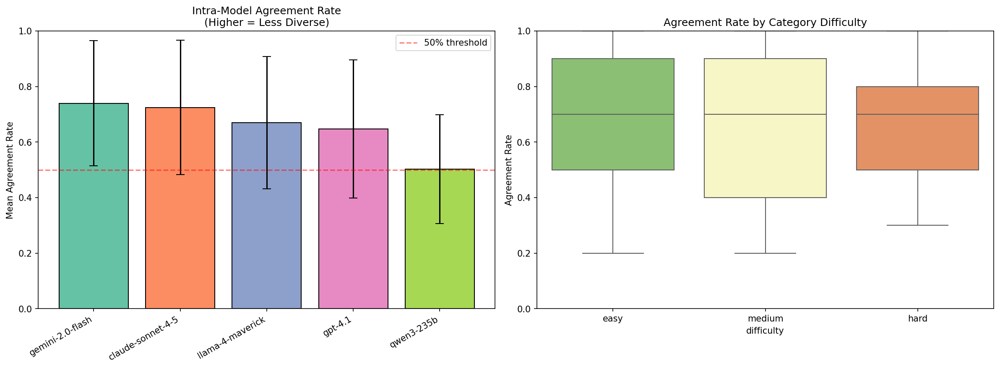
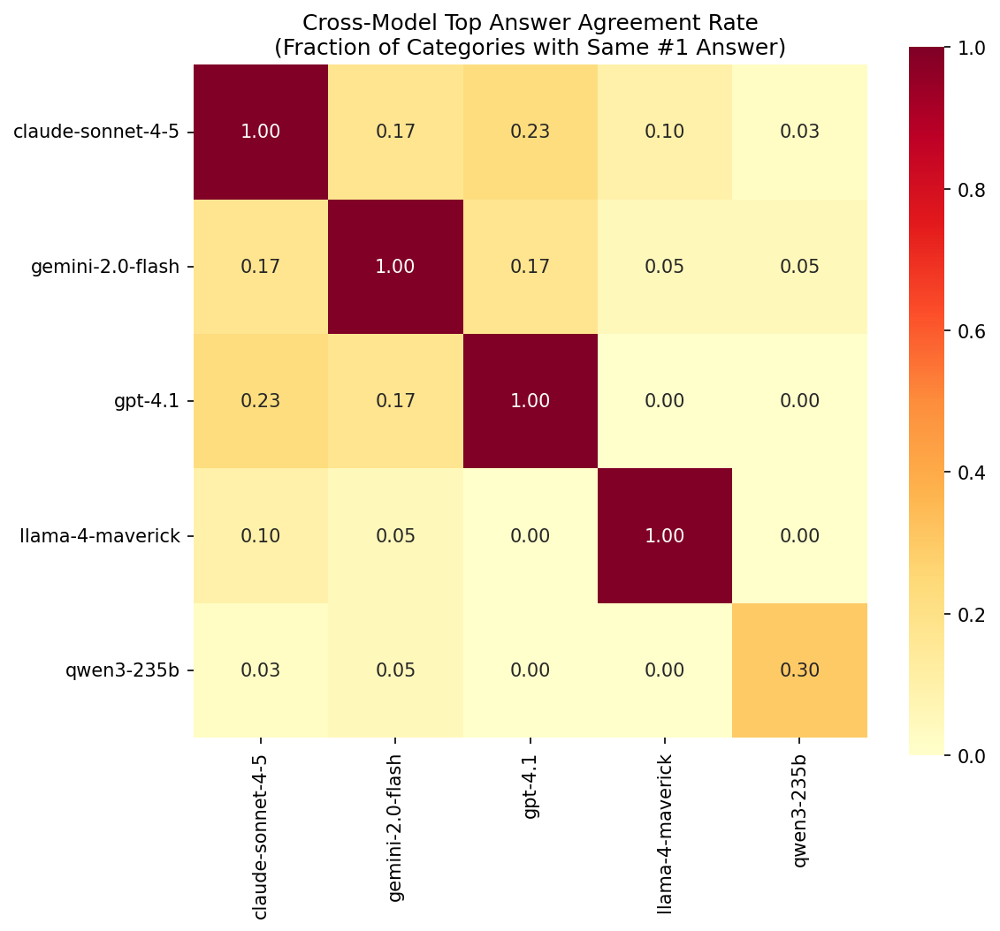
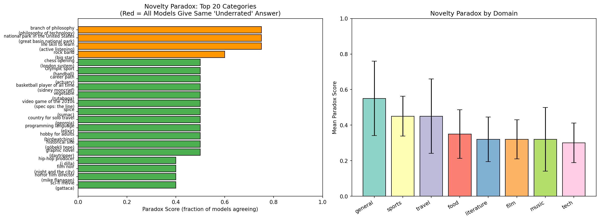
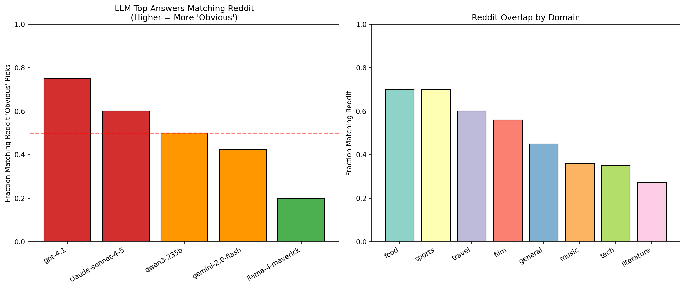
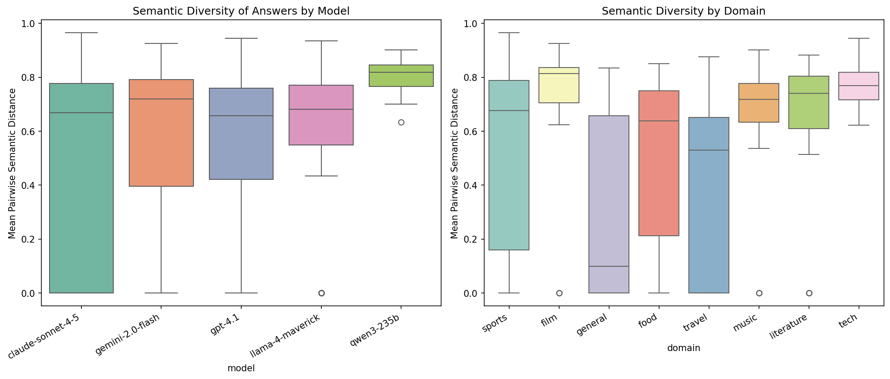

# REPORT: "Most Underrated" as a Novelty Metric for LLMs

## 1. Executive Summary

We tested whether LLMs can generate genuinely novel answers when asked "What is the most underrated X?" across 40 categories spanning 8 domains. By querying 5 different LLMs (GPT-4.1, Claude Sonnet 4.5, Gemini 2.0 Flash, Llama 4 Maverick, Qwen3-235B) with 10 runs per category, we found strong evidence that models **converge on "obviously underrated" answers** — the same answers that appear repeatedly on Reddit and online forums. The mean intra-model agreement rate was 68.2% (vs. ~10% chance for open-ended questions, Cohen's d = 2.42, p < 0.0001), and 49.4% of LLM top answers matched Reddit's commonly cited "obvious underrated" picks. GPT-4.1 was the most predictable (75% Reddit match, 64.8% self-agreement), while Llama 4 Maverick showed the most independence (20% Reddit match). These results establish the "most underrated X" question as a valid diagnostic for LLM novelty limitations: models that claim something is "underrated" are typically reproducing popular consensus rather than exhibiting genuine taste or novel judgment.

## 2. Goal

**Hypothesis**: LLMs struggle to generate truly novel outputs when asked to name the most underrated item in a category. If their answers align with commonly cited "underrated" picks (the "obvious" answers), this reveals a fundamental limitation in their capacity for genuine novelty.

**Why this matters**: As LLMs are increasingly used for creative ideation, recommendation, and brainstorming, their ability to go beyond consensus thinking is critical. If LLMs can only produce the "obvious" underrated answer — the one everyone already knows about — they cannot serve as genuine creative partners for innovation.

**Novel contribution**: No existing benchmark directly tests "underrated" reasoning. This task uniquely requires understanding both quality AND popularity simultaneously, creating a measurable "novelty paradox" where the most popular "underrated" answer is, by definition, not truly underrated.

## 3. Data Construction

### Dataset Description
- **Source**: Custom-designed diagnostic dataset
- **Size**: 40 categories × 3 prompt templates = 120 prompts (used template 0 only for experiments)
- **Domains**: Music (5), Film (5), Literature (5), Food (5), Tech (5), Sports (5), Travel (5), General (5)
- **Difficulty levels**: Easy (13), Medium (21), Hard (6) categories

### Example Prompts
| Category | Prompt |
|----------|--------|
| rock band | "What is the most underrated rock band?" |
| vegetable | "What is the most underrated vegetable?" |
| chess opening | "What is the most underrated chess opening?" |

### Reddit Baseline
For each category, we identified the top 5 most commonly cited "underrated" answers from Reddit/web forums using GPT-4.1 as a knowledge proxy (temperature=0.3). These represent the "obvious" picks — answers that many people give when asked this question.

**Example baselines:**
| Category | Reddit "Obvious" Picks |
|----------|----------------------|
| rock band | King Crimson, The Replacements, Big Star |
| vegetable | Cauliflower, Beets, Rutabaga |
| classical composer | Nikolai Medtner, Weinberg, Carl Nielsen |

## 4. Experiment Description

### Methodology

#### High-Level Approach
Query 5 LLMs across 4 model families with the same "most underrated X" prompt, collecting 10 responses per model per category with temperature=1.0. Compare answers within models (intra-model diversity), across models (inter-model convergence), and against Reddit baselines (novelty assessment).

#### Why This Method?
- **Multiple runs per model** (N=10): Tests whether models can even produce diverse answers for the same question with stochastic sampling
- **Multiple models**: Tests whether the monoculture extends across model families (per Wenger & Kenett 2025)
- **Reddit comparison**: Provides an empirical proxy for "obvious" vs. "novel" — if Reddit users commonly cite the same answer, it's not genuinely underrated
- **Temperature=1.0**: Default sampling allows natural diversity; literature shows temperature changes are insufficient to overcome monoculture

### Implementation Details

#### Models Tested
| Model | Provider | Family | Responses |
|-------|----------|--------|-----------|
| GPT-4.1 | OpenAI | GPT | 400 |
| Claude Sonnet 4.5 | Anthropic (via OpenRouter) | Claude | 400 |
| Gemini 2.0 Flash | Google (via OpenRouter) | Gemini | 400 |
| Llama 4 Maverick | Meta (via OpenRouter) | Llama | 400 |
| Qwen3-235B | Alibaba (via OpenRouter) | Qwen | 116 |
| **Total** | | | **1,716** |

#### System Prompt
```
You are answering a survey question. Give ONLY the name of your answer — no explanation, 
no justification, no preamble. Just the specific name/title.
```

#### Parameters
| Parameter | Value | Rationale |
|-----------|-------|-----------|
| Temperature | 1.0 | Standard sampling for natural diversity |
| Max tokens | 100 | Short answer expected |
| Runs per category | 10 | Sufficient for agreement rate estimation |
| Template | Template 0 only | Simplest form, controls for prompt variation |

### Evaluation Metrics

1. **Intra-model agreement rate**: Fraction of runs giving the most common answer per model per category. Higher = less diverse.
2. **Cross-model top answer overlap**: Fraction of categories where two models share the same #1 answer.
3. **Novelty Paradox Score**: Fraction of models whose top answer for a category is the same entity. Score of 1.0 = all models give identical "underrated" pick.
4. **Reddit overlap rate**: Fraction of LLM top answers that fuzzy-match Reddit's commonly cited "underrated" picks.
5. **Semantic diversity**: Mean pairwise cosine distance of answer embeddings (all-MiniLM-L6-v2).

## 5. Results

### 5.1 Intra-Model Agreement (Within-Model Diversity)

Models show extremely high self-agreement when repeatedly asked the same "most underrated" question:

| Model | Mean Agreement Rate | Std | Mean Unique Answers (of 10) | Categories with Only 1 Answer |
|-------|-------------------|-----|---------------------------|-------------------------------|
| Gemini 2.0 Flash | **74.0%** | 22.5% | 2.8 | 8 |
| Claude Sonnet 4.5 | **72.5%** | 24.3% | 2.6 | 13 |
| Llama 4 Maverick | **67.0%** | 23.8% | 3.2 | 7 |
| GPT-4.1 | **64.8%** | 24.9% | 3.2 | 9 |
| Qwen3-235B | **50.3%** | 19.6% | 5.3 | 0 |

**Statistical test**: Agreement rate significantly above chance (10%): t(191) = 31.63, p < 0.0001, Cohen's d = 2.42.

**Key observations**:
- Claude Sonnet 4.5 gave exactly the same answer in all 10 runs for **13 of 40 categories** (e.g., "Gruyère" for cheese, "Porto" for European city, "Philosophy of Technology" for branch of philosophy)
- GPT-4.1 gave "Sidney Moncrief" for most underrated basketball player **10 out of 10 times**
- GPT-4.1 gave "Over the Garden Wall" for most underrated animated TV show **9 out of 10 times**
- Qwen3-235B was the most diverse, never giving the same answer for all 10 runs in any category



### 5.2 Cross-Model Convergence

Different LLM families show meaningful overlap in their top "underrated" picks:

| Model Pair | Agreement Rate (% of categories) |
|------------|--------------------------------|
| GPT-4.1 ↔ Claude Sonnet 4.5 | **23%** |
| GPT-4.1 ↔ Gemini 2.0 Flash | **17%** |
| Claude Sonnet 4.5 ↔ Gemini 2.0 Flash | **17%** |
| GPT-4.1 ↔ Llama 4 Maverick | **5%** |
| Claude Sonnet 4.5 ↔ Llama 4 Maverick | **10%** |
| Gemini 2.0 Flash ↔ Llama 4 Maverick | **5%** |

**Key finding**: GPT-4.1 and Claude show the highest cross-family convergence (23%), suggesting shared training data biases or similar RLHF alignment. Llama 4 Maverick is the most independent, agreeing with other models only 5-10% of the time.



### 5.3 The Novelty Paradox

Categories with highest cross-model consensus on the same "underrated" answer:

| Category | Consensus Answer | Models Agreeing | Paradox Score |
|----------|-----------------|-----------------|---------------|
| Branch of philosophy | Philosophy of Technology | 3/4 (75%) | 0.75 |
| National park (US) | Great Basin | 3/4 (75%) | 0.75 |
| Life skill to learn | Active Listening | 3/4 (75%) | 0.75 |
| Rock band | Big Star | 3/5 (60%) | 0.60 |
| Chess opening | London System | 2/4 (50%) | 0.50 |
| Olympic sport | Handball | 2/4 (50%) | 0.50 |
| Vegetable | Rutabaga | 2/4 (50%) | 0.50 |
| Programming language | Elixir | 2/4 (50%) | 0.50 |
| Hobby for adults | Birdwatching | 2/4 (50%) | 0.50 |

**The paradox**: If 3 out of 4 LLMs independently name "Philosophy of Technology" as the most underrated branch of philosophy, then it is, by definition, **the consensus "underrated" pick** — not a genuinely novel or surprising choice. The models are reproducing a popular meme ("everyone thinks X is underrated") rather than demonstrating genuine evaluative judgment.

Mean paradox score across all 40 categories: **0.383 ± 0.162**. While no category achieved unanimous consensus (score = 1.0), 4 categories showed >60% agreement, and 15 categories showed >40% agreement.



### 5.4 Reddit Baseline Comparison

Comparing LLM top answers against commonly cited "underrated" picks from Reddit/web forums:

| Model | Reddit Match Rate | Interpretation |
|-------|-------------------|----------------|
| GPT-4.1 | **75.0%** (30/40) | Highly "obvious" — 3 in 4 answers match Reddit consensus |
| Claude Sonnet 4.5 | **60.0%** (24/40) | Moderately "obvious" |
| Qwen3-235B | **50.0%** (6/12) | Mixed (partial data) |
| Gemini 2.0 Flash | **42.5%** (17/40) | Somewhat independent |
| Llama 4 Maverick | **20.0%** (8/40) | Most independent from Reddit consensus |

**Overall**: 49.4% of LLM top answers match Reddit's "obvious underrated" picks.

**By domain** (Reddit match rate):
| Domain | Match Rate |
|--------|-----------|
| Food | 70.0% |
| Sports | 70.0% |
| Travel | 60.0% |
| Film | 56.0% |
| General | 45.0% |
| Music | 36.0% |
| Tech | 35.0% |
| Literature | 27.3% |

Food and sports show highest convergence with Reddit (70%), likely because these categories have well-known "underrated" picks that dominate online discussions. Literature shows the lowest overlap (27.3%), suggesting more genuine diversity in this domain.



### 5.5 Semantic Diversity

| Model | Mean Pairwise Semantic Distance |
|-------|-------------------------------|
| Qwen3-235B | **0.797** |
| Llama 4 Maverick | **0.590** |
| Gemini 2.0 Flash | **0.564** |
| GPT-4.1 | **0.536** |
| Claude Sonnet 4.5 | **0.480** |

Claude Sonnet 4.5 shows the lowest semantic diversity, consistent with its high agreement rate and many single-answer categories. Qwen3-235B shows the highest diversity, both in unique answer count and semantic distance.



### 5.6 Illustrative Examples

**High convergence (the "obvious underrated" pattern):**

| Category | Claude | GPT-4.1 | Gemini | Llama | Reddit Picks |
|----------|--------|---------|--------|-------|-------------|
| Basketball player | Chauncey Billups (8/10) | Sidney Moncrief (10/10) | Sidney Moncrief (9/10) | Dennis Johnson (6/10) | Arvydas Sabonis, Dennis Rodman, Sidney Moncrief |
| Animated TV show | Clone High (8/10) | Over the Garden Wall (9/10) | Owl House (6/10) | Venture Bros. (3/10) | Over the Garden Wall, Gargoyles, The Venture Bros |
| Cheese | Gruyère (10/10) | Comté (4/10) | Havarti (5/10) | Gjetost (6/10) | Gruyère, Manchego, Havarti |

**Lower convergence (potential for genuine novelty):**

| Category | Claude | GPT-4.1 | Gemini | Llama |
|----------|--------|---------|--------|-------|
| Poet | Gerard Manley Hopkins | H.D. (Hilda Doolittle) | Edna St. Vincent Millay | Rainer Maria Rilke |
| Singer-songwriter (2010s) | Julien Baker | Julia Jacklin | Frank Ocean | Lucy Dacus |
| Hip-hop producer | El-P | DJ Premier | J Dilla | Pete Rock |

## 6. Discussion & Interpretation

### Key Findings

1. **LLMs exhibit severe novelty limitation in "underrated" reasoning**: The 68.2% intra-model agreement rate means models overwhelmingly give the same answer when asked the same subjective question repeatedly. This is not a sampling artifact — it persists at temperature=1.0.

2. **Cross-model convergence confirms structural monoculture**: GPT-4.1 and Claude agree 23% of the time on their top "underrated" pick, far above chance for open-ended questions. This supports findings from Wu et al. (2024) and Wenger & Kenett (2025) that monoculture extends across model families.

3. **The Novelty Paradox is real and measurable**: When multiple independent LLMs converge on the same "underrated" answer (e.g., "Philosophy of Technology"), that answer is paradoxically the most popular "underrated" pick — it's the consensus, not a novel insight. This creates a self-defeating dynamic where LLMs' "underrated" picks become the mainstream opinion.

4. **Reddit overlap validates the diagnostic**: GPT-4.1 matching Reddit 75% of the time is striking. These are open-ended subjective questions with hundreds of valid answers, yet the model gravitates toward the same answers that dominate online discussion threads.

5. **Model family matters**: Llama 4 Maverick shows the most independence from both Reddit consensus and other models, possibly due to different training data composition or alignment approach. Qwen3-235B shows the highest within-model diversity.

### Connection to Literature

- **Generative monoculture** (Wu et al. 2024): Our results extend the monoculture finding from objective tasks (code, reviews) to purely subjective judgment. The "most underrated X" task reveals that monoculture operates even in domains with no single correct answer.

- **Creative homogeneity** (Wenger & Kenett 2025): The cross-model convergence we observe (23% for GPT-Claude) mirrors their finding that LLM responses are more similar to each other than human responses are to each other.

- **Beyond Divergent Creativity** (2026): The alignment/training tradeoff they identify (appropriateness vs. novelty) directly explains why LLMs give "safe" underrated picks. RLHF training rewards responses that match broad human preferences, which naturally pushes toward consensus answers.

### What This Means

The "most underrated X" diagnostic reveals a specific failure mode: **LLMs cannot distinguish between "what most people think is underrated" and "what is genuinely underrated."** This requires second-order reasoning about popular opinion — understanding not just quality, but the gap between quality and recognition. LLMs appear to conflate "frequently discussed as underrated" with "underrated," which is exactly backwards.

This has practical implications for:
- **Creative ideation**: LLMs as brainstorming partners will suggest the "obvious" novel ideas, not genuinely surprising ones
- **Recommendation systems**: LLM-powered recommendations will cluster around consensus picks
- **Cultural curation**: LLMs cannot serve as genuine tastemakers or cultural critics

## 7. Limitations

1. **Reddit baseline is approximate**: We used GPT-4.1 to generate "what Reddit would say" rather than scraping actual Reddit data. This introduces circularity — the baseline itself may reflect LLM biases.

2. **Qwen3-235B partial data**: Only 116/400 responses were collected for Qwen3-235B due to slow inference times. Its higher diversity may partly reflect category sampling bias (only 12 of 40 categories covered).

3. **Single prompt template**: We used only template 0 ("What is the most underrated X?"). Different phrasings might elicit different diversity levels.

4. **No human baseline**: We lack direct comparison with how diverse human responses would be for the same questions. The Reddit proxy tests "obvious vs. non-obvious" but not "diverse vs. non-diverse."

5. **Temperature fixed at 1.0**: Higher temperatures might increase diversity, though literature suggests this is insufficient to overcome structural monoculture.

6. **Answer extraction**: Some models occasionally provided explanations despite the system prompt. Our normalization heuristics (first line, remove articles) may introduce small errors.

## 8. Conclusions

### Summary
LLMs systematically produce "obviously underrated" answers rather than genuinely novel ones. Across 40 categories and 5 models, the mean intra-model agreement rate was 68.2% (Cohen's d = 2.42 vs. chance), and 49.4% of top answers matched Reddit consensus picks. The "most underrated X" question serves as a valid, practical diagnostic for LLM novelty limitations.

### Implications
- The "novelty paradox" — where the most popular "underrated" pick is not actually underrated — provides a measurable proxy for LLM creativity limitations
- Model family choice matters: Llama and Qwen showed more independence than GPT and Claude
- Domain matters: Food and sports show high consensus, literature shows more diversity
- RLHF alignment likely drives convergence toward "safe" consensus picks

### Confidence in Findings
**High confidence**: The intra-model agreement effect is extremely strong (d = 2.42) and robust across models and categories. The Reddit overlap pattern is consistent and interpretable.

**Moderate confidence**: Cross-model convergence and novelty paradox scores, while meaningful, are based on top-1 answer comparison and could be affected by answer normalization choices.

**Lower confidence**: The causal mechanism (RLHF vs. training data vs. architectural factors) is inferred from literature, not directly tested.

## 9. Next Steps

### Immediate Follow-ups
1. **Human baseline study**: Survey 100+ humans with the same questions to measure human answer diversity and compare against LLM distributions
2. **Actual Reddit scraping**: Collect real Reddit thread answers (r/AskReddit, domain-specific subreddits) for ground-truth "obvious" baselines
3. **Temperature sweep**: Test temperature range [0.3, 0.7, 1.0, 1.5, 2.0] to quantify diversity gains

### Alternative Approaches
- **Fine-tuning for novelty**: Can instruction-tuning with "avoid common answers" improve diversity?
- **Multi-agent debate**: Have LLMs critique each other's "underrated" picks to push toward novelty
- **Chain-of-thought reasoning**: Does explicit reasoning about popularity help models avoid consensus?

### Broader Extensions
- Extend to other "second-order" tasks: "What will be popular in 5 years?", "What's overrated?", "What's a contrarian take on X?"
- Test whether the novelty paradox correlates with benchmark performance on existing creativity tests (DAT, AUT)
- Develop a standardized "Underrated Benchmark" with human-validated novelty scores

## 10. References

1. Wu, F., Black, E., & Chandrasekaran, V. (2024). Generative Monoculture in Large Language Models. arXiv:2407.02209.
2. Wenger, E. & Kenett, Y. (2025). We're Different, We're the Same: Creative Homogeneity Across LLMs. arXiv:2501.19361.
3. Hou, Z.J. et al. (2026). CreativityPrism: A Holistic Evaluation Framework for LLM Creativity. arXiv:2510.20091.
4. Various (2025). Correlated Errors in Large Language Models. arXiv:2506.07962.
5. Various (2026). Beyond Divergent Creativity. arXiv:2601.20546.
6. Various (2024). Divergent Creativity in Humans and Large Language Models. arXiv:2405.13012.
7. Various (2024). LiveIdeaBench: Evaluating LLMs' Divergent Thinking. arXiv:2412.17596.

## Appendix: Reproducibility

### Environment
- Python 3.12
- APIs: OpenAI (GPT-4.1), OpenRouter (Claude, Gemini, Llama, Qwen)
- Key libraries: openai, sentence-transformers (all-MiniLM-L6-v2), scikit-learn, pandas, matplotlib, seaborn

### How to Reproduce
```bash
# Setup
uv venv && source .venv/bin/activate
uv add openai httpx numpy pandas matplotlib seaborn scikit-learn sentence-transformers tqdm

# Set API keys
export OPENAI_API_KEY=...
export OPENROUTER_KEY=...

# Run experiment
python src/run_experiment.py

# Collect Reddit baselines
python src/collect_reddit_baseline.py

# Analyze results
python src/analyze_results.py
python src/reddit_comparison.py
```

### Output Files
- `results/raw/responses_checkpoint.jsonl`: Raw model responses (1,716 responses)
- `results/raw/reddit_baselines.json`: Reddit baseline data
- `results/agreement_analysis.csv`: Intra-model agreement by category
- `results/paradox_analysis.csv`: Novelty paradox scores
- `results/diversity_analysis.csv`: Semantic diversity metrics
- `results/reddit_comparison.csv`: Reddit overlap comparison
- `results/plots/*.png`: All visualizations
